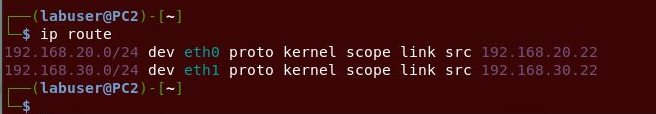
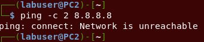
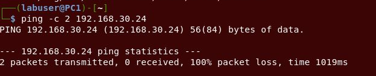
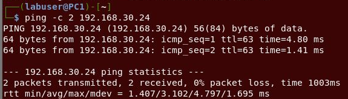
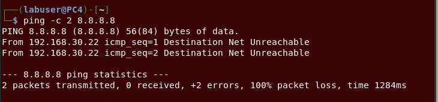
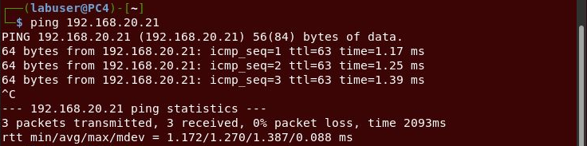

# Lab Report #1

## Excercise 1: 2 VMs in the Same Subnet

### Task 1
**Q: Should PC1 be able to ping PC2? To which interface?**

a. Yes - PC1 should be able to ping PC2 using the eth0 interface.

b. No - PC1 should not be able to ping the global internet.

### Task 2
**Open a terminal window in ICaNS-PC1 and ping twice interface eth0 of ICaNS-PC2**

a. Yes, the pings are successful.

b. 

### Task 3
**In the same terminal window, ping twice the interface eth1 of ICaNS-PC2**

a. Yes, the pings are successful. The pings are sucessful because the configuration in PC2 routing table. 

When PC1 sends a packet to 192.168.30 (eth1 interface) it uses the default route of 192.168.20.22 (eth0) to do so. When PC2 recieves the packet on eth0 - it will check the destination address (192.168.30.22) against the routing table. 

In this image you can see that the routing table of PC2 it shares that the traffic for 192.168.30.0/24 network should be going through eth1. As a result PC2 forwards the packets from eth0 to eth1. 

### Task 4
**Open a terminal window in PC2 and ping twice Google.com**

a. No - the pings are not sucessful to Google from PC2. This is because there is no default route from PC2. 

As seen in the above image there is no default route so - this means there is no route the to the internet (or Google.com)

b. 

### Task 5
**In the same terminal window in PC1, ping twice to eth0 of ICaNS-PC4 IP@ 192.168.30.24**

a. No - the pings are not successful. If PC4 is not powered on when PC2 forwards the packets from eth0 to eth1 there will be no device on the other end to respond. 

b. 

Currently, PC4 is not powered on. This means that there is nothing to respond to the packets that PC1 is sending. PC1 is sending packets to PC2 via eth0. PC2 then uses its routing table to forward the packets via eth1 which it does, however, there is no device prepared to respond to those packets which is why we see 100% packet loss since nothing was returned. 

--- 
## Excercise 2: VMs in 2 different subnets

## Task 1
**Open a terminal in PC1, ping twice eth0 of ICaNS-PC4 IP 192.168.30.24** 

a. Yes, the pings are succesful. In this instance PC2 is acting as router between the 2 subnets allowing for PC1 to communicate with PC4. 

When PC1 pings 192.168.30.24 it checks the routing table -- it sends the packet to the default gateway which is eth0 of PC2. 

PC2 gets the packet on eth0 and then checks its own routing table. It is able to forward the packet to eth1 which then forwards the packet to PC4. 

b. 
  
As stated in the part a - PC2 is acting as a router between the 2 subnets. When PC1 sends a packet it sends via the default gateway via eth0 of PC2. PC2 is acting as a router and is able to forward the packet to eth1 where PC4 is listening. 

## Task 2
**Open a terminal window in PC4 and ping twice Google.com.**

a. No the pings are not successful

b. 
Comparing the results with Task 4 of exercise 1 with the results that I just ran I see that the error message from PC4 when pinging google is slightly different. However, when pinging google from PC2 the error stated "ping: connect: Network is unreachable". This indicates there is no default gateway to the internet configured. 

When pinging google from PC4 the error stated: "Destination Net Unreachable" this indicates that the router or gateway cannot find the route to the destination network. This indicates that the packets are being send to PC2 but since PC2 is not connected to the internet, it doesnt know where to route the packets to. 

Comparing the results with Task 3 of exercise I see similar results. 

In this instance, PC4 is routing its packets through PC2 to PC1. PC4 default route points to PC2 on eth1. It then forwards them via eth0 to PC1. 

c.  

